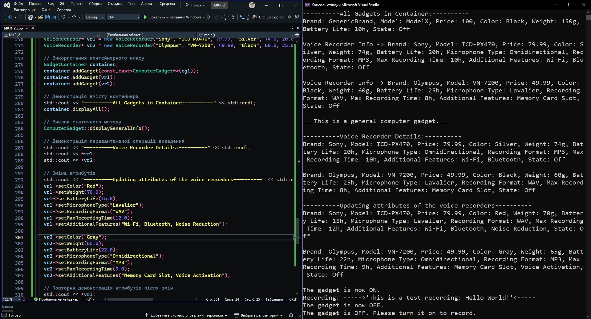

# Модульна контрольна робота №2

## Класи: Комп'ютерний гаджет ← диктофон

Створено ієрархію класів `Комп'ютерний гаджет` ← `диктофон`. Класи містять конструктори з параметрами, статичні дані і методи.
Передбачено:

1. віртуальні методи і віртуальний деструктор;
2. константні методи і константні об'єкти;
3. перевантаження операції виведення;
4. застосування контейнерного класу для роботи з об'єктами;
5. демонстрацію роботи з об'єктами відповідно до п. п. 1) - 4).

### Теоретична частина:

1.  **_Обґрунтування застосування віртуальних методів._**

Віртуальні методи використовуються для забезпечення поліморфізму, що дозволяє викликати методи похідного класу через покажчик або посилання на базовий клас. У моєму випадку метод getInfo оголошено віртуальним у класі ComputerGadget і перевизначено у похідному класі VoiceRecorder. Це дозволяє викликати метод getInfo для об'єктів типу VoiceRecorder через покажчик або посилання на батьківський (базовий) клас ComputerGadget, забезпечуючи правильний вивід інформації про конкретний об'єкт.

2.  **_Обґрунтування застосування константних методів._**

Константні методи, такі як getInfo, getColor, getWeight, getBatteryLife, getIsOn та інші, використовуються для забезпечення гарантії, що ці методи не змінюють стан об'єкта. Це важливо для забезпечення безпеки і стабільності коду, особливо коли методи лише зчитують інформацію з об'єкта і не мають потреби змінювати його стан. А також це дозволяє викликати ці методи для константних об'єктів або через константні посилання, що робить код більш гнучким.

3.  **_Структура віртуальних таблиць._**

Структура віртуальних таблиць для даної задачі буде виглядати наступним чином:

    1.  ComputerGadget: Віртуальна таблиця містить вказівник на метод getInfo.
    2.  VoiceRecorder: Віртуальна таблиця містить вказівник на перевизначений метод getInfo.

Це дозволяє викликати правильну версію методу getInfo для об'єктів VoiceRecorder, навіть якщо вони представлені як об'єкти ComputerGadget.

4.  **_Обґрунтування вибору контейнерного класу._**

Використання класу-контейнера (GadgetContainer) дозволяє нам легко керувати колекцією об'єктів типу ComputerGadget. Це забезпечує такі переваги:

    1. Централізоване управління: Ми можемо легко додавати, видаляти та отримувати доступ до об'єктів у контейнері.
    2. Очищення пам'яті: У деструкторі класу-контейнера ми звільняємо пам'ять, що запобігає витокам пам'яті.
    3. Інкапсуляція: Контейнер приховує внутрішню реалізацію управління об'єктами і надає чітко визначений інтерфейс для користувачів.

5. **_Обґрунтування застосування перевантаженої операції виведення._**

Перевантаження операції виведення (operator<<) для класу VoiceRecorder забезпечує зручний спосіб форматованого виведення інформації про об'єкт. Це полегшує виведення даних і покращує читабельність коду:

    1.  Зручність: Використання оператора << спрощує синтаксис виведення і робить код більш зрозумілим та менш громіздким.
    2.  Клієнтський код: Забезпечує простий спосіб для клієнтського коду виводити інформацію про об'єкт, не потребуючи знання деталей реалізації.

### Cкриншот роботи програми:

